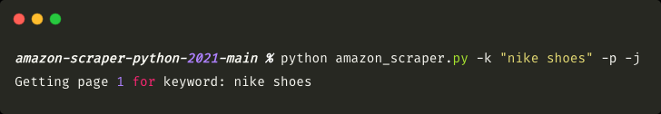
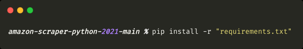
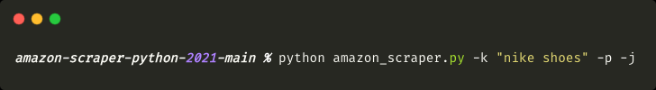
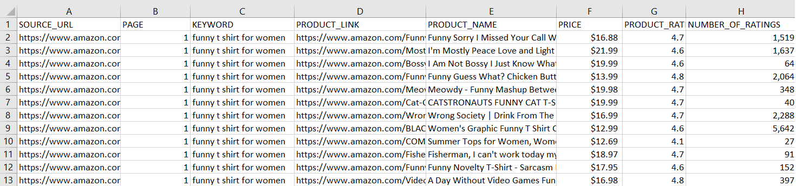

# Amazon Product Scraper 2022

[](https://github.com/topics/python) [](https://github.com/topics/web-scraping) [](https://github.com/topics/amazon)

## Description

A command-line tool for scraping [Amazon](https://www.amazon.com/) product data to `CSV` or `JSON` format(s).



## Requirements

- Python 3
- pip3

## Installation

Using `git clone` (you'll need [git](https://git-scm.com/downloads) installed for this):

```bash
git clone https://github.com/gummo0091/amazon-scraper-python-2022
```

Or download and extract the `zip` file of the project manually

You'll also need to install requirements for the project to run.
Locate `amazon-product-scraper` folder via terminal and type `pip install -r requirements.txt`:



## Usage

To launch the Amazon scraper locate the `amazon-product-scraper` folder via terminal and type `python amazon_scraper.py -k "your keyword"`. This will start the program. 

***NOTE: you must declare either*** `-k` or `--keyword` ***before entering your keyword. It's a required argument.***

_Example_:



`amazon_scraper.py` - the name of a scraper file.

`-k` or `--keyword` - required argument to pass before entering your keyword.

`-p` or `--proxies` - optional argument to enable proxies. To avoid getting blocked I highly recommend using proxies. I'm using [Residential Proxies from Oxylabs](https://oxylabs.io/products/residential-proxy-pool). For highest success rate, I suggest Residential Proxies over Datacenter as they're almost impossible to detect.

`-j` or `--json` - optional argument for storing extracted data in `.json` format. Default output format is `.csv`.

### Example of product data #1: JSON
```json
[
    {
        "SOURCE_URL": "https://www.amazon.com/s?k=funny+t+shirt+for+women&page=1",
        "PAGE": 1,
        "KEYWORD": "funny t shirt for women",
        "PRODUCT_LINK": "https://www.amazon.com/Mostly-T-Shirt-Womens-Letter-Printed/dp/B07QN2NQ59/ref=sr_1_3?dchild=1&keywords=funny+t+shirt+for+women&qid=1627833682&sr=8-3",
        "PRODUCT_NAME": "I'm Mostly Peace Love and Light Funny T-Shirt Womens Graphic Printed Short Sleeve Tops Tee",
        "PRICE": "$21.99",
        "PRODUCT_RATING": "4.6",
        "NUMBER_OF_RATINGS": "1,637"
    },
    {
        "SOURCE_URL": "https://www.amazon.com/s?k=funny+t+shirt+for+women&page=1",
        "PAGE": 1,
        "KEYWORD": "funny t shirt for women",
        "PRODUCT_LINK": "https://www.amazon.com/YITAN-Women-Graphic-Funny-X-Large/dp/B074QMG4D7/ref=sr_1_4?dchild=1&keywords=funny+t+shirt+for+women&qid=1627833682&sr=8-4",
        "PRODUCT_NAME": "YITAN Women's Cute Juniors Tops Teen Girl Tee Funny T Shirt",
        "PRICE": "$12.99",
        "PRODUCT_RATING": "4.6",
        "NUMBER_OF_RATINGS": "12,281"
    },
    {
        "SOURCE_URL": "https://www.amazon.com/s?k=funny+t+shirt+for+women&page=1",
        "PAGE": 1,
        "KEYWORD": "funny t shirt for women",
        "PRODUCT_LINK": "https://www.amazon.com/DANVOUY-Womens-V-Neck-Doesnt-Definitely/dp/B07V55ZXVS/ref=sr_1_5?dchild=1&keywords=funny+t+shirt+for+women&qid=1627833682&sr=8-5",
        "PRODUCT_NAME": "DANVOUY Womens If My Mouth Doesn't Say It My Face Definitely Will T Shirt",
        "PRICE": "$12.99",
        "PRODUCT_RATING": "4.6",
        "NUMBER_OF_RATINGS": "6,787"
    }]
```

### Example of product data #2: CSV


